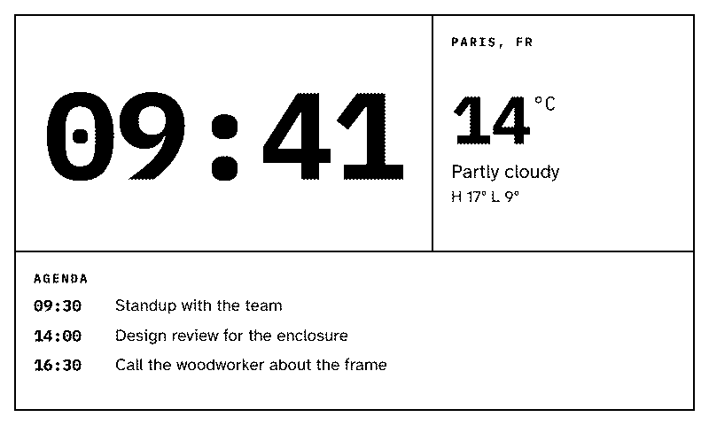
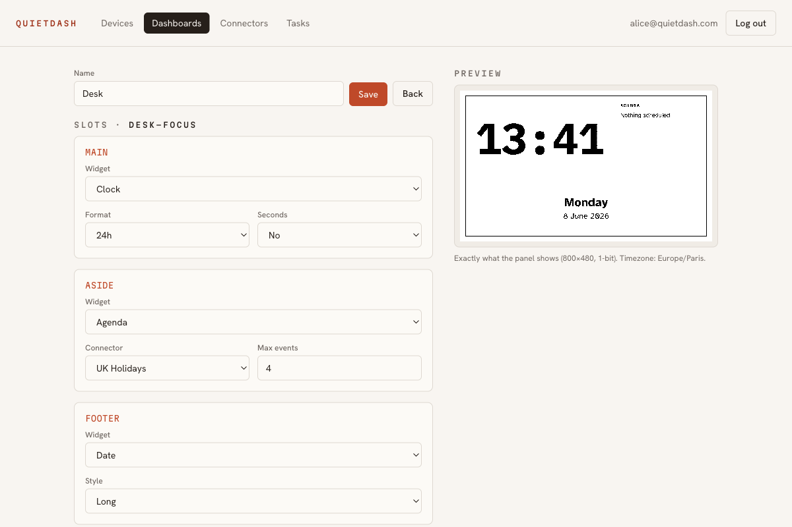
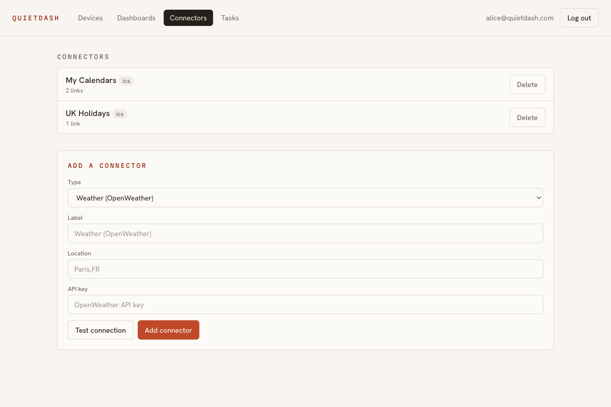

# QuietDash

A small e-ink screen for your desk. It shows the few things you actually care about, then it sits there quietly. No glow, no notifications, no reason to keep checking it.

**[quietdash.com →](https://quietdash.com)**



## What it is

QuietDash drives a Waveshare 7.5" e-Paper display (800×480, black and white) from a Raspberry Pi. You pick a layout, drop a few widgets into it, and the screen renders them as dithered ink, refreshing a few times an hour. That's it. The whole point is a screen you stop noticing.

It started as a thing for my own desk. I posted it on Reddit, around a hundred people asked to be told when it was ready, and now I'm building it out properly.

## What's on it

A small set of widgets, designed to sit together, not a store of a thousand plugins:

- **Clock** and **date**
- **Weather**, current conditions and the day's range (bring your own OpenWeather key)
- **Agenda**, the next few events from any public calendar (paste an ICS link, no account)
- **Tasks**, a local checklist you keep in the studio
- **Focus**, your pomodoro intervals at a glance
- **Feed**, a few headlines from one or more RSS sources

You don't drag pixels around. You pick one of a handful of designed layouts (a big single slot, a desk-focus split, a 2×2 grid, and so on) and choose a widget for each slot. We own the composition so the 1-bit result actually looks good.

## Configure it from your browser

Open the studio, pick a layout, fill the slots. The preview on the right is the real thing: the server renders the exact 1-bit PNG the panel will pull, so what you see is what shows up on the desk.



Widgets that need outside data go through **connectors**: server-side, bring-your-own-key, with the key encrypted at rest. A calendar or feed connector can hold several links and the widget merges them. Nothing is hard-wired and nothing talks to the cloud from your panel.



A device can also rotate dashboards on a schedule (a focus board during work hours, weather and agenda in the evening). The studio renders everything; the panel just pulls the current image.

## Why e-ink

A backlit screen is one more thing pulling at you. E-ink doesn't glow and doesn't move, so it reads like paper on the desk. You look when you want to, not when it pings you, because it never pings you.

## Run it yourself

QuietDash is open source and self-hostable. One server renders your dashboard, one or more Pi devices pull the image and show it. The server can run on the Pi itself (all in one) or on any machine on your network. Nothing leaves your LAN by default.

Repo layout:

- `apps/server` : Node server, renders the 1-bit image, the API, serves the studio (SQLite, no cloud)
- `apps/studio` : the web app where you log in, pair devices, and arrange your dashboard
- `packages/render` : the 1-bit dithered renderer (satori, resvg, Atkinson dither), shared by server and studio
- `packages/connectors` : the server-side data layer (weather, ICS, RSS)
- `packages/shared` : the layout contract and shared types
- `device/` : the Python client that runs on the Pi and drives the panel

### Server and studio

Needs Node 22+ and pnpm 10+.

```bash
pnpm install
pnpm --filter @quietdash/studio build      # build the web app
pnpm --filter @quietdash/server start      # API + studio on http://localhost:3000
```

Open http://localhost:3000 and set a password. For studio development with hot reload, run the server in one terminal and `pnpm --filter @quietdash/studio dev` in another (it proxies the API).

Connector API keys are encrypted at rest. Set `QUIETDASH_SECRET_KEY` (64 hex characters) for a real install; left unset, the server derives a stable key from its own session secret so a quick self-host still works.

### Pair a device

On a Raspberry Pi with the Waveshare panel:

```bash
# point it at your server; it shows a QR on the panel
QUIETDASH_SERVER_URL=http://<server-ip>:3000 python3 device/quietdash_device.py
```

Scan the QR with your phone, approve the device in the studio, and the panel starts showing your dashboard. If the Pi has no network yet, it opens its own setup hotspot and a QR to join WiFi first. Full hardware walkthrough is in `device/PI-TEST.md`, device details in `device/README.md`.

### Self-host or hosted

- `AUTH_MODE=single-password` (default): one instance, one password, the Pi can be the server.
- `AUTH_MODE=multi-user`: accounts, where each person sees only their own devices. For a hosted version.

## The layout format is open

The dashboard JSON is a stable, documented contract you can hand-author, and a widget is a small pure render function you can contribute:

- `docs/layout-schema.md` : the layout and widget config schema
- `docs/widgets.md` : how to add your own widget

## Status

I'm building this in the open-ish. The marketing site and waitlist are live at [quietdash.com](https://quietdash.com). If you'd like to be told when it ships, the waitlist is the place.

## License

TBD.
